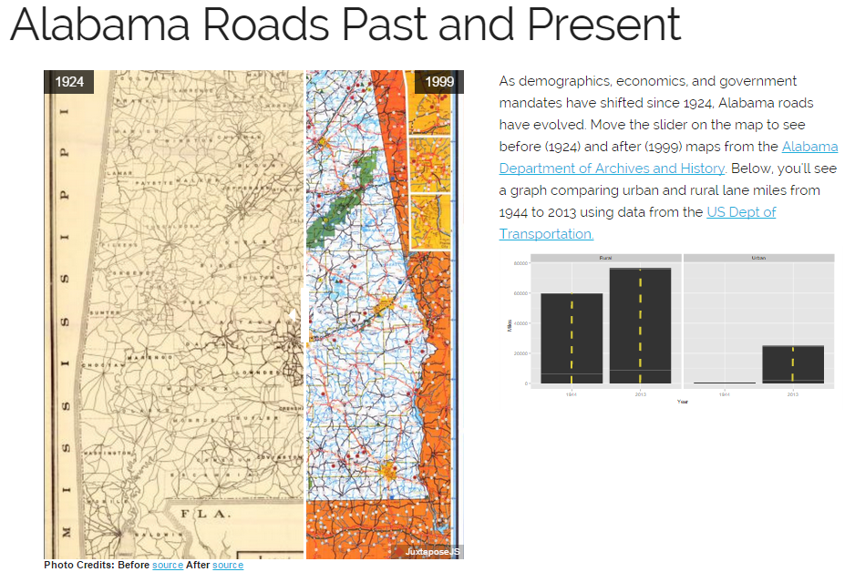

### Final Map for Coursera | [Maps and the Geospatial Revolution](https://class.coursera.org/maps-003)

http://timelyportfolio.github.io/coursera_maps_geospatial/ tells an interactive story of changes in Alabama roads in the 19th and 20th century.  A slider with Juxtapose allows a user to quickly examine the before (1924) Alabama road map with an after (1999) Alabama road map.  Population shifts, demographic changes, economic progress, and the creation of the interstate system are all shown with this overlay technique.  In Southwest Alabama, we can see the hub of Choctaw sort of disappear over the 75 years.  Also, we can see how many of the interstates parallel or overlap, well traveled routes from 1924.  We saw similar overlay techniques in Lesson 3 of this course for natural disasters, economic development, and environmental pollution.

For additional context, I compared urban/rural road miles from 1944 to 2013.  I would have liked to compare 1924 to 2013 road miles in Alabama, but unfortunately the oldest data I could find was from 1944.  This graph required data from the US Dept of Transportation, the R package ggplot2, some manual data entry, and some customization with Inkscape.  Road miles did not increase as much as I would have expected, but these do not factor in how many lanes are on the roads.  An additional metric lane road miles would provide a better measure, but this metric was not provided in 1944.

The primary expected audience for this map story would be current or potential residents of Alabama.

</img>
